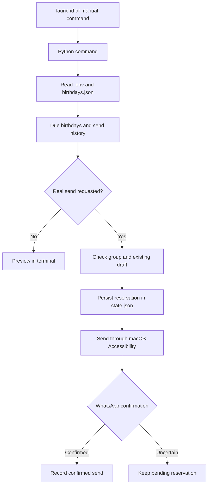

# WhatsApp Birthday Bot — macOS

A local Python bot that sends birthday wishes to a **WhatsApp Desktop group on macOS**. People and their birthdays are stored in a private JSON file, while shared settings live in `.env`. The native `launchd` scheduler runs the checks, and macOS Accessibility controls WhatsApp.

The project automates the WhatsApp interface without using the WhatsApp Business API or a hosted service. By default, it previews birthdays that are due. Sending real messages requires an explicit command.

## Compatibility and limitations

- **macOS only** for sending and scheduling: MacBook, iMac, Mac mini, or another Mac. Windows, Linux, and mobile devices are not supported.
- **Python 3.12 recommended**; the pinned PyObjC dependencies require Python 3.10 or later.
- Tested configuration: Apple Silicon Mac, macOS 26, Python 3.12, and WhatsApp Desktop **2.26.37.22**. Other WhatsApp versions and Intel Macs have not been validated by this project's tests. See [PyObjC platform support](https://pyobjc.readthedocs.io/en/latest/supported-platforms.html).
- WhatsApp Desktop must be installed, signed in to the intended account, and accessible in an **active, unlocked macOS session**, with a network connection for sending.
- The bot may open WhatsApp and bring it to the foreground. Avoid interacting with WhatsApp during a send. If a draft already exists, the bot stops to preserve it.
- Group names must match exactly and identify a single conversation. French and English menu names are supported.
- A WhatsApp update may change Accessibility selectors. The bot stops if expected controls are missing or ambiguous.
- The bot cannot run while the Mac is powered off. It catches up on birthdays **on the same day**, after the configured sending time. It does not send overdue wishes the following day, wake the Mac, or unlock the session.
- The “sent” status reflects what WhatsApp exposes; it does not guarantee that every recipient has received or read the message.

## Installation

Install [Python 3.12](https://www.python.org/downloads/) and WhatsApp Desktop, then run:

```sh
git clone https://github.com/Wolfidy7/whatsapp-birthday-bot-macos.git
cd whatsapp-birthday-bot-macos

python3.12 -m venv .venv
source .venv/bin/activate
python -m pip install -r requirements.txt

cp .env.example .env
cp birthdays.json.example birthdays.json
chmod 600 .env birthdays.json
```

The commands below assume the `.venv` is activated. Otherwise, replace `python` with `.venv/bin/python`. The example files contain fictional data only. Customize `.env` and `birthdays.json` before enabling real sends.

## macOS permissions

The required permission is **Accessibility**. It allows the bot to read WhatsApp controls, activate menus, and click fields when needed. This implementation does not capture screenshots or use AppleScript: it does not request Screen Recording, Automation, or Full Disk Access permissions.

### Manual commands

1. Run `python permissions.py` from the terminal you will use for the bot.
2. Open **System Settings → Privacy & Security → Accessibility**.
3. Use **+** to add your terminal, such as Terminal or iTerm, or the application hosting an integrated terminal. Enable its switch. Depending on how the bot is launched, macOS may identify Python as the process that needs permission.
4. Restart the application if macOS asks you to, then check:

```sh
python main.py --doctor
```

The diagnostic checks Accessibility access, the unlocked session, and the WhatsApp window. It does not send a message. See [Apple's Privacy & Security settings guide](https://support.apple.com/en-gb/guide/mac-help/mchl211c911f/27/mac/27).

### Background sends with launchd

Permission granted to the terminal does not necessarily cover Python when `launchd` starts it. Check that context separately:

```sh
python scheduler.py --check-permissions
```

If access is denied, this command prints **the actual Python executable path** to add to the same Accessibility list. You can also display that path yourself:

```sh
python -c 'import sys; from pathlib import Path; print(Path(sys.executable).resolve())'
```

Click **+**, then use **Cmd+Shift+G** to navigate to the displayed path. If the file picker hides the Python executable, select it in Finder and **drag it into the Accessibility list**, then enable its switch. Run `--check-permissions` again: an `OK` result confirms permission in the `launchd` context.

Real-send scheduler installations and background one-off tasks refuse to install if this check fails. If you change your Python installation, check permissions again for the new executable.

## Configuration

### Shared settings: .env

The `.env` file is read directly on each check. You do not need to run `source .env` or export shell variables. Terminal environment variables do not override its values.

| Variable | Purpose |
| --- | --- |
| `TIMEZONE` | IANA timezone, such as `UTC` or `Europe/Paris`. |
| `WHATSAPP_GROUP` | Exact name of the target group. |
| `SEND_TIME` | Shared birthday sending time, in `HH:MM` format and the configured `TIMEZONE`. |
| `MESSAGE_HEADER` | Shared header, automatically followed by two newline characters. |
| `MESSAGE_TEMPLATE` | Shared message body, with `{name}` as the only supported placeholder. |
| `MAX_MESSAGES_PER_RUN` | Maximum birthdays sent per run, from 1 to 20. |
| `SCHEDULER_INTERVAL_SECONDS` | Birthday check interval, in seconds. |
| `ONE_OFF_INTERVAL_SECONDS` | One-off message check interval, in seconds. |
| `TEST_MESSAGE` | Default message for `test_send.py`. |
| `ONE_OFF_MESSAGE` | Default message for `schedule_once.py`. |

Format: one `KEY=value` per line, or a **double-quoted** string using JSON escapes (`\n`, `\"`). Lines beginning with `#` are comments. Inline comments, single quotes, and shell substitutions are not interpreted. Every variable in the example is required; unknown or duplicate keys stop execution. Use `{{` or `}}` for literal braces in the message template.

Changes to the group, sending time, message, and limit take effect on the next check. Changing `SCHEDULER_INTERVAL_SECONDS` requires **uninstalling and reinstalling** the scheduler because `launchd` stores that interval in its `.plist`.

### People: birthdays.json

```json
{
  "birthdays": [
    {"id": "camille-example", "name": "Camille", "month": 5, "day": 14},
    {"id": "robin-example", "name": "Robin", "month": 11, "day": 22}
  ]
}
```

Each person has a unique ID, a name, a month, and a day. No age or birth year is required. February 29 birthdays are sent only in leap years.

**Keep IDs stable**: changing the `id` of a birthday that has already been sent can cause another send on the same day. The group, time, and message stay in `.env`.

## Preview and first test

```sh
# Preview due birthdays without opening WhatsApp or recording a send.
python main.py

# Check a dedicated test group without writing a message.
python test_send.py --group "Test"

# Actually send TEST_MESSAGE to that group (once per day).
python test_send.py --group "Test" --send

# Send today's due birthdays after SEND_TIME.
python main.py --send

# View history and uncertain results.
python main.py --history
```

A “no birthdays to send” result is normal when nobody is due today. Automated tests inject fictional dates, so there is no need to change your Mac's date. You can provide a custom test message with `--message`. The command-line output currently uses French messages.

## Schedule birthdays

```sh
# Generate a local .plist for inspection without installing a service.
python scheduler.py

# Install automatic checks in preview mode.
python scheduler.py --install

# After checking permissions and completing the first test, enable real sends.
python scheduler.py --check-permissions
python scheduler.py --uninstall
python scheduler.py --install --send

# Stop and remove the scheduler.
python scheduler.py --uninstall
```

The user agent is installed in `~/Library/LaunchAgents`. It uses absolute paths to the project and the active Python executable. Do not move the project after installation: uninstall before moving it, then reinstall from the new location.

The scheduler checks birthdays when it loads, including at login, and then according to `SCHEDULER_INTERVAL_SECONDS`. The example uses 300 seconds, or five minutes. Checks are not aligned to fixed clock times, so a birthday scheduled for 09:00 may be sent a few minutes later. Installation with `--send` may immediately send a birthday that is already due.

Remove an existing installation before replacing it. To apply a new interval from `.env`:

```sh
python scheduler.py --uninstall
python scheduler.py --install --send
```

This operation preserves the send history. After installation, inspect the service with:

```sh
launchctl print gui/$(id -u)/com.whatsapp-birthday-bot.scheduler
```

## Schedule a one-off message

These commands schedule a **real send**; they do not require `--send`:

```sh
# Schedule ONE_OFF_MESSAGE in Test in two minutes.
python schedule_once.py --in-minutes 2 --group "Test"

# Choose a specific message.
python schedule_once.py --in-minutes 2 --group "Test" --message "Demo reminder"

# Wait in an authorized terminal without a background service.
python schedule_once.py --in-minutes 2 --group "Test" --foreground

# Cancel the scheduled message before it sends.
python schedule_once.py --cancel
```

Without `--group`, the group comes from `.env`. WhatsApp opens immediately to verify the group; the delay starts **after that check**. At the scheduled time, the bot searches for the group again to avoid sending to a different conversation.

Only one one-off task can be scheduled at a time. Its message, group, due time, and check interval are fixed when it is scheduled: cancel and reschedule to change them. The agent never sends before the displayed time and removes itself after confirmation or a sending error. A missed message expires at the end of its local day. `--foreground` requires the terminal to stay open.

## Duplicate prevention and uncertain results

Before the sending action, the bot records a pending reservation in `state.json`. Once a new outgoing message with the expected text and a sent, delivered, or read status is confirmed, it records the confirmed send. Text comparison accounts for bold, italic, and strikethrough markers that WhatsApp removes from the rendered text.

An uncertain result keeps its reservation and is **not resent automatically**, even after a restart or in the following year. A lock prevents concurrent executions. State updates are written atomically with private file permissions.

Check the group in WhatsApp before resolving a reservation:

```sh
python main.py --history

# Example: the message was actually sent.
python main.py --resolve camille-example 2030-05-14 sent

# Only after checking that the message was not sent.
python main.py --resolve camille-example 2030-05-14 retry
```

Use the ID and date of the actual pending entry. `retry` allows another attempt if the birthday is still due today. Do not erase the history to unblock the bot: this removes duplicate protection. A failure before sending may leave the text as a draft; check it before another attempt.

## Architecture and tools



The calendar and durable state use the Python standard library: `zoneinfo` for timezones, JSON for data, `fcntl` for locks, and an atomically replaced temporary file for writes. The macOS adapter uses **PyObjC**: Cocoa for applications and the clipboard, ApplicationServices for the Accessibility tree, and Quartz for clicks and session state. **launchd** runs user tasks without an additional server.

Pasting uses the Edit menu and works with AZERTY and QWERTY layouts. The clipboard is restored unless it has changed in the meantime. Controls are identified by their selectors and current positions. The bot does not directly set `AXValue` or `AXFocused` attributes in WhatsApp Catalyst, to avoid freezes observed during testing.

| File | Purpose |
| --- | --- |
| `main.py` | Main CLI: preview, send, diagnostics, history, and pending-result resolution. |
| `birthday_bot.py` | Validation, due-birthday calculation, locking, and durable state. |
| `settings.py` | Reads and validates `.env` settings. |
| `whatsapp_ax.py` | Finds the group, pastes, sends, and confirms through Accessibility. |
| `scheduler.py` | Generates, installs, and removes the recurring birthday LaunchAgent. |
| `schedule_once.py` | Schedules a one-off message and automatically removes its agent. |
| `background_check.py` | Permission probe run by `launchd` without reading conversations. |
| `test_send.py` | Checks a group and sends an explicitly requested test message. |
| `permissions.py` | Requests and displays Accessibility permission status. |
| `inspect_whatsapp.py` | Inspects selectors; hides message-bubble content by default. |
| `inspect-whatsapp.py` | Legacy raw inspector, kept for reference; its output may include private messages. |
| `.env.example` | Shared-settings template with fictional values. |
| `birthdays.json.example` | People template with fictional birthdays. |
| `requirements.txt` | Pinned macOS dependencies. |
| `tests/` | Calendar, state, example, adapter, and scheduling tests. |
| `.github/workflows/tests.yml` | macOS and Python 3.12 CI without WhatsApp sends. |
| `.gitignore` | Excludes private data and generated files. |
| `LICENSE` | MIT license. |
| `README.md` | Installation, usage, architecture, and troubleshooting guide. |

## Diagnostics, logs, and tests

```sh
python main.py --doctor
python scheduler.py --check-permissions
python inspect_whatsapp.py
python -m unittest discover -s tests -v
```

Automated tests use fake Accessibility trees and mocked processes. They do not send messages or require a WhatsApp session. CI runs them on macOS with Python 3.12.

`inspect_whatsapp.py --include-messages` includes private message text in its output. Do not publish those diagnostics. Observed selectors include `TokenizedSearchBar_TextView`, `ChatListSearchView_ChatResult`, `NavigationBar_HeaderViewButton`, `ChatBar_ComposerTextView`, and `WAMessageBubbleTableViewCell`.

Logs are stored in `logs/bot.log`, `logs/scheduler.log`, `logs/scheduler-error.log`, `logs/one-off.log`, and `logs/one-off-error.log`. `bot.log` rotates at 1 MB with three backups; `launchd` output logs are not automatically purged. Previews display message text in the terminal without storing it in `bot.log`.

The `.env`, `birthdays.json`, and `state.json` files, locks, logs, exported Accessibility trees, and generated `.plist` files stay local and are ignored by Git. Examples are published and must be copied during installation. Preserve the history when updating the project.

References: [ApplicationServices in PyObjC](https://pyobjc.readthedocs.io/en/latest/apinotes/ApplicationServices.html), [Apple's launchd agents guide](https://developer.apple.com/library/archive/documentation/MacOSX/Conceptual/BPSystemStartup/Chapters/CreatingLaunchdJobs.html).

## License

[MIT](LICENSE), copyright 2026 Wolfidy7.
