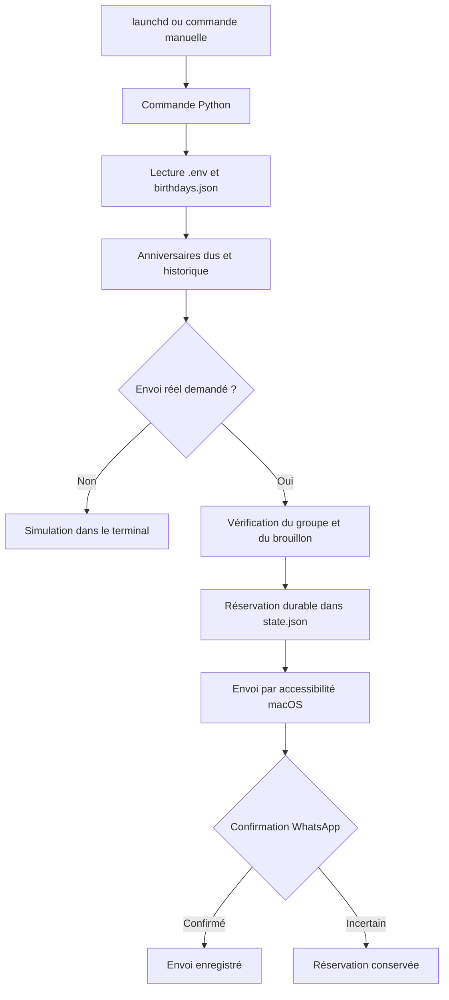

# WhatsApp Birthday Bot — macOS

Bot local en Python pour souhaiter les anniversaires dans un groupe **WhatsApp Desktop sur macOS**. Les personnes sont décrites dans un fichier JSON privé; les réglages communs sont centralisés dans `.env`. Le planificateur natif `launchd` lance les vérifications, et l’accessibilité macOS permet de piloter WhatsApp.

Le projet utilise l’interface de WhatsApp, sans API WhatsApp Business ni service hébergé. Le mode par défaut simule les anniversaires dus. Les envois réels nécessitent une commande explicite.

## Compatibilité et limites

- **macOS uniquement** pour le pilotage et la planification : MacBook, iMac, Mac mini ou autre Mac. Windows, Linux et les appareils mobiles ne sont pas pris en charge.
- **Python 3.12 recommandé**; les dépendances PyObjC épinglées demandent Python 3.10 ou plus.
- Configuration testée : Mac Apple Silicon, macOS 26, Python 3.12 et WhatsApp Desktop **2.26.37.22**. Les autres versions de WhatsApp et les Mac Intel n’ont pas été validés par les essais de ce projet. Voir la [compatibilité de PyObjC](https://pyobjc.readthedocs.io/en/latest/supported-platforms.html).
- WhatsApp Desktop doit être installé, connecté au compte voulu, et accessible dans une **session ouverte et déverrouillée**, avec une connexion réseau pour l’envoi.
- Le bot peut ouvrir WhatsApp et le mettre au premier plan. Éviter de manipuler WhatsApp pendant un envoi. Un brouillon existant provoque un arrêt pour le préserver.
- Les noms de groupe doivent correspondre exactement et ne pas être ambigus. Les menus reconnus sont en français ou en anglais.
- Une mise à jour de WhatsApp peut modifier les sélecteurs d’accessibilité. Le bot s’arrête si les contrôles attendus sont absents ou ambigus.
- Le bot ne fonctionne pas pendant que le Mac est éteint. Il rattrape les anniversaires dus **le même jour**, après l’heure prévue. Aucun envoi tardif n’est effectué le lendemain. Il ne réveille pas le Mac et ne déverrouille pas la session.
- Le statut « envoyé » reflète ce que WhatsApp expose; il ne garantit pas que tous les destinataires ont reçu ou lu le message.

## Installation

Installer [Python 3.12](https://www.python.org/downloads/) et WhatsApp Desktop, puis exécuter :

```sh
git clone https://github.com/Wolfidy7/whatsapp-birthday-bot-macos.git
cd whatsapp-birthday-bot-macos

python3.12 -m venv .venv
source .venv/bin/activate
python -m pip install -r requirements.txt

cp .env.example .env
cp birthdays.json.example birthdays.json
chmod 600 .env birthdays.json
```

Les commandes suivantes supposent que le `.venv` est activé. Sinon, remplacer `python` par `.venv/bin/python`. Les fichiers d’exemple contiennent uniquement des données fictives. Adapter `.env` et `birthdays.json` avant d’activer des envois réels.

## Autorisations macOS

L’autorisation nécessaire est **Accessibilité**, qui permet de lire les contrôles de WhatsApp, d’activer ses menus et, si nécessaire, de cliquer dans ses champs. L’implémentation n’utilise pas de capture d’écran ni de scripts AppleScript : elle ne demande pas les droits Enregistrement de l’écran, Automatisation ou Accès complet au disque.

### Commandes manuelles

1. Lancer `python permissions.py` depuis le terminal utilisé pour le bot.
2. Ouvrir **Réglages système → Confidentialité et sécurité → Accessibilité**.
3. Ajouter avec **+** le terminal utilisé, par exemple Terminal ou iTerm, ou l’application hébergeant le terminal intégré. Activer son interrupteur. Selon le contexte de lancement, macOS peut identifier Python comme processus à autoriser.
4. Relancer la commande si macOS demande de rouvrir l’application, puis vérifier :

```sh
python main.py --doctor
```

Le diagnostic vérifie l’accessibilité, la session déverrouillée et la fenêtre WhatsApp. Il n’envoie aucun message. Voir les [réglages de confidentialité et sécurité chez Apple](https://support.apple.com/en-gb/guide/mac-help/mchl211c911f/27/mac/27).

### Envois en arrière-plan avec launchd

L’autorisation du terminal ne couvre pas nécessairement le Python lancé par `launchd`. Vérifier ce contexte séparément :

```sh
python scheduler.py --check-permissions
```

En cas de refus, cette commande indique **le chemin réel de l’exécutable Python** à ajouter dans la même liste Accessibilité. Pour afficher ce chemin soi-même :

```sh
python -c 'import sys; from pathlib import Path; print(Path(sys.executable).resolve())'
```

Cliquer sur **+**, puis utiliser **Cmd+Maj+G** pour accéder au chemin affiché. Si le sélecteur masque le fichier Python, sélectionner le fichier dans le Finder et le **glisser-déposer dans la liste Accessibilité**, puis activer son interrupteur. Relancer `--check-permissions` : un résultat `OK` valide la permission dans le contexte de `launchd`.

Les installations avec envoi réel et les tâches ponctuelles en arrière-plan refusent de s’installer si ce contrôle échoue. En cas de changement d’installation Python, vérifier de nouveau les permissions du nouvel exécutable.

## Configuration

### Réglages communs : .env

Le fichier `.env` est lu directement à chaque vérification. Aucun `source .env` ni export shell n’est nécessaire. Les variables du terminal ne remplacent pas ses valeurs.

| Variable | Rôle |
| --- | --- |
| `TIMEZONE` | Fuseau IANA, par exemple `UTC` ou `Europe/Paris`. |
| `WHATSAPP_GROUP` | Nom exact du groupe cible. |
| `SEND_TIME` | Heure commune des anniversaires, au format `HH:MM`, dans `TIMEZONE`. |
| `MESSAGE_HEADER` | En-tête commun, suivi automatiquement de deux sauts de ligne. |
| `MESSAGE_TEMPLATE` | Message commun avec le seul marqueur `{name}`. |
| `MAX_MESSAGES_PER_RUN` | Maximum d’anniversaires envoyés par passage, entre 1 et 20. |
| `SCHEDULER_INTERVAL_SECONDS` | Intervalle de vérification des anniversaires, en secondes. |
| `ONE_OFF_INTERVAL_SECONDS` | Intervalle de vérification des messages ponctuels, en secondes. |
| `TEST_MESSAGE` | Message par défaut de `test_send.py`. |
| `ONE_OFF_MESSAGE` | Message par défaut de `schedule_once.py`. |

Format : une variable `KEY=value` par ligne, ou une chaîne entre **guillemets doubles** avec les échappements JSON (`\n`, `\"`). Les lignes commençant par `#` sont des commentaires. Les commentaires en fin de ligne, les guillemets simples et les substitutions shell ne sont pas interprétés. Toutes les variables du modèle sont requises; les clés inconnues ou dupliquées provoquent un arrêt. Pour une accolade littérale dans le modèle du message, utiliser `{{` ou `}}`.

Les changements de groupe, d’heure, de texte et de limite sont pris en compte au passage suivant. Changer `SCHEDULER_INTERVAL_SECONDS` exige de **désinstaller puis réinstaller** le scheduler, car `launchd` mémorise cet intervalle dans son `.plist`.

### Personnes : birthdays.json

```json
{
  "birthdays": [
    {"id": "camille-example", "name": "Camille", "month": 5, "day": 14},
    {"id": "robin-example", "name": "Robin", "month": 11, "day": 22}
  ]
}
```

Chaque personne possède un identifiant unique, un prénom, un mois et un jour. Aucun âge ni année de naissance n’est nécessaire. Les anniversaires du 29 février sont envoyés uniquement les années bissextiles.

**Garder les identifiants stables** : changer l’`id` d’un anniversaire déjà envoyé peut provoquer un nouvel envoi le même jour. Le groupe, l’heure et le message restent dans `.env`.

## Simulation et premier test

```sh
# Afficher les anniversaires dus sans ouvrir WhatsApp ni enregistrer d’envoi.
python main.py

# Vérifier un groupe dédié, sans écrire de message.
python test_send.py --group "Test"

# Envoyer réellement TEST_MESSAGE dans ce groupe (une fois par jour).
python test_send.py --group "Test" --send

# Envoyer les anniversaires dus aujourd’hui, après SEND_TIME.
python main.py --send

# Consulter l’historique et les résultats incertains.
python main.py --history
```

« Aucun anniversaire à envoyer » est normal si aucune personne n’est due aujourd’hui. Les tests automatisés injectent des dates fictives : aucun changement de date du Mac n’est nécessaire. Un message de test personnalisé peut être fourni avec `--message`.

## Planifier les anniversaires

```sh
# Générer un .plist local pour inspection, sans installer de service.
python scheduler.py

# Installer une vérification automatique en simulation.
python scheduler.py --install

# Après validation des permissions et du premier test, activer les envois réels.
python scheduler.py --check-permissions
python scheduler.py --uninstall
python scheduler.py --install --send

# Arrêter et retirer le scheduler.
python scheduler.py --uninstall
```

L’agent utilisateur est installé dans `~/Library/LaunchAgents`. Il utilise les chemins absolus du projet et du Python actif. Ne pas déplacer le projet après installation : désinstaller avant le déplacement et réinstaller depuis le nouvel emplacement.

Le scheduler vérifie les anniversaires dès son chargement, notamment à l’ouverture de session, puis selon `SCHEDULER_INTERVAL_SECONDS`. L’exemple utilise 300 secondes, soit cinq minutes. Les passages ne sont pas alignés sur des heures fixes; un anniversaire prévu à 09:00 peut donc être envoyé quelques minutes après. L’installation avec `--send` peut envoyer immédiatement un anniversaire déjà dû.

Une installation existante doit être retirée avant remplacement. Pour appliquer un nouvel intervalle dans `.env` :

```sh
python scheduler.py --uninstall
python scheduler.py --install --send
```

L’historique est conservé par cette opération. Après installation :

```sh
launchctl print gui/$(id -u)/com.whatsapp-birthday-bot.scheduler
```

## Programmer un message ponctuel

Ces commandes programment un **vrai envoi**; elles n’exigent pas `--send` :

```sh
# Programmer ONE_OFF_MESSAGE dans Test dans deux minutes.
python schedule_once.py --in-minutes 2 --group "Test"

# Choisir un texte précis.
python schedule_once.py --in-minutes 2 --group "Test" --message "Rappel de démonstration"

# Attendre depuis un terminal autorisé, sans service en arrière-plan.
python schedule_once.py --in-minutes 2 --group "Test" --foreground

# Annuler la programmation avant l’envoi.
python schedule_once.py --cancel
```

Sans `--group`, le groupe vient de `.env`. WhatsApp s’ouvre immédiatement pour vérifier le groupe; le délai commence **après cette vérification**. À l’échéance, le groupe est recherché à nouveau pour éviter d’envoyer dans une autre conversation.

Une seule tâche ponctuelle peut être programmée à la fois. Le texte, le groupe, l’échéance et l’intervalle sont figés à la programmation : annuler puis reprogrammer pour les changer. L’agent n’envoie jamais avant l’heure affichée et se retire après confirmation ou erreur d’envoi. Un message manqué expire à la fin de sa journée locale. `--foreground` exige que le terminal reste ouvert.

## Doublons et résultats incertains

Avant l’action d’envoi, le bot enregistre une réservation dans `state.json`. Après confirmation d’un nouveau message sortant avec le texte attendu et un statut envoyé, distribué ou lu, il enregistre l’envoi confirmé. La comparaison tient compte des marqueurs gras, italiques ou barrés que WhatsApp retire du texte rendu.

Un résultat incertain reste réservé et n’est **pas renvoyé automatiquement**, même après un redémarrage ou l’année suivante. Un verrou empêche les exécutions simultanées. Les changements d’état sont écrits atomiquement avec des permissions privées.

Vérifier le groupe dans WhatsApp avant de résoudre une réservation :

```sh
python main.py --history

# Exemple : le message a effectivement été envoyé.
python main.py --resolve camille-example 2030-05-14 sent

# Seulement après vérification que le message n’a pas été envoyé.
python main.py --resolve camille-example 2030-05-14 retry
```

Adapter l’identifiant et la date à l’entrée réellement réservée. `retry` permet un nouvel essai si l’anniversaire est encore dû aujourd’hui. Ne pas effacer l’historique pour débloquer le bot : cela supprime la protection contre les doublons. Un échec avant envoi peut laisser le texte comme brouillon; le vérifier avant une nouvelle tentative.

## Architecture et outils



Le calendrier et l’état durable utilisent la bibliothèque standard Python : `zoneinfo` pour les fuseaux, JSON pour les données, `fcntl` pour les verrous et un fichier temporaire remplacé atomiquement pour les écritures. L’adaptateur macOS utilise **PyObjC** : Cocoa pour les applications et le presse-papiers, ApplicationServices pour l’arbre d’accessibilité, Quartz pour les clics et l’état de session. **launchd** lance les tâches utilisateur sans serveur supplémentaire.

Le collage passe par le menu Édition, compatible avec les dispositions AZERTY et QWERTY. Le presse-papiers est restauré sauf s’il a été modifié entre-temps. Les contrôles sont identifiés par leurs sélecteurs et leur position actuelle. Le bot n’écrit pas directement les attributs `AXValue` ou `AXFocused` dans WhatsApp Catalyst, afin d’éviter les blocages observés pendant les essais.

| Fichier | Rôle |
| --- | --- |
| `main.py` | Commande principale : simulation, envoi, diagnostic, historique et résolution. |
| `birthday_bot.py` | Validation, calcul des anniversaires dus, verrou et état durable. |
| `settings.py` | Lecture et validation des réglages `.env`. |
| `whatsapp_ax.py` | Recherche du groupe, collage, envoi et confirmation par accessibilité. |
| `scheduler.py` | Génération, installation et retrait du LaunchAgent annuel. |
| `schedule_once.py` | Programmation ponctuelle et retrait automatique de son agent. |
| `background_check.py` | Sonde de permission exécutée par `launchd`, sans lire les conversations. |
| `test_send.py` | Vérification d’un groupe et envoi de test explicite. |
| `permissions.py` | Demande et affiche le statut d’autorisation Accessibilité. |
| `inspect_whatsapp.py` | Inspection des sélecteurs; masque le contenu des bulles par défaut. |
| `inspect-whatsapp.py` | Ancien inspecteur brut, conservé pour référence; sa sortie peut inclure des messages privés. |
| `.env.example` | Modèle des réglages communs avec valeurs fictives. |
| `birthdays.json.example` | Modèle des personnes avec anniversaires fictifs. |
| `requirements.txt` | Dépendances macOS épinglées. |
| `tests/` | Tests du calendrier, de l’état, des exemples, de l’adaptateur et des planificateurs. |
| `.github/workflows/tests.yml` | CI macOS et Python 3.12, sans envoi WhatsApp. |
| `.gitignore` | Exclusion des données privées et des fichiers générés. |
| `LICENSE` | Licence MIT. |
| `README.md` | Installation, utilisation, architecture et diagnostic. |

## Diagnostic, journaux et tests

```sh
python main.py --doctor
python scheduler.py --check-permissions
python inspect_whatsapp.py
python -m unittest discover -s tests -v
```

Les tests automatisés utilisent des arbres d’accessibilité fictifs et des processus simulés; ils ne publient aucun message et ne requièrent pas de session WhatsApp. La CI les exécute sur macOS avec Python 3.12.

`inspect_whatsapp.py --include-messages` inclut les textes privés dans la sortie. Ne pas publier ces diagnostics. Les sélecteurs observés sont notamment `TokenizedSearchBar_TextView`, `ChatListSearchView_ChatResult`, `NavigationBar_HeaderViewButton`, `ChatBar_ComposerTextView` et `WAMessageBubbleTableViewCell`.

Les journaux sont dans `logs/bot.log`, `logs/scheduler.log`, `logs/scheduler-error.log`, `logs/one-off.log` et `logs/one-off-error.log`. `bot.log` tourne à 1 Mo avec trois sauvegardes; les sorties de `launchd` ne sont pas automatiquement purgées. Les simulations affichent les textes dans le terminal sans les archiver dans `bot.log`.

Les fichiers `.env`, `birthdays.json`, `state.json`, les verrous, les journaux, les arbres d’accessibilité exportés et les `.plist` générés restent locaux et sont ignorés par Git. Les exemples sont publiés et doivent être copiés à l’installation. Conserver l’historique lors des mises à jour.

Références : [ApplicationServices dans PyObjC](https://pyobjc.readthedocs.io/en/latest/apinotes/ApplicationServices.html), [agents launchd chez Apple](https://developer.apple.com/library/archive/documentation/MacOSX/Conceptual/BPSystemStartup/Chapters/CreatingLaunchdJobs.html).

## Licence

[MIT](LICENSE), copyright 2026 Wolfidy7.
